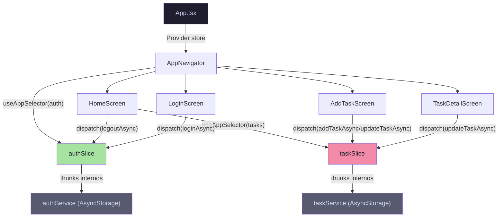

# Migración a Redux Toolkit (RTK) — TaskMaster Local

## Contexto

Actualmente la app maneja su estado global mediante:
- **`useState` locales** en cada pantalla (ej: `tasks`, `username`, `isAuthenticated`).
- **Llamadas directas a `authService` / `taskService`** que leen/escriben `AsyncStorage` desde los componentes.
- Un **polling con `setInterval` cada 1s** en [AppNavigator.tsx](file:///g:/Facultad/Aplicaciones%20movile/gestor-de-tareas/src/navigation/AppNavigator.tsx#L34-L37) para detectar cambios de sesión.

Esto genera acoplamiento, prop drilling implícito y lógica de negocio distribuida en las pantallas.

**Objetivo**: Migrar a **Redux Toolkit** como única fuente de verdad en memoria, manteniendo `AsyncStorage` como capa de persistencia vía `createAsyncThunk`, respetando el nivel **SSR** de tipado estricto con TypeScript.

---

## User Review Required

> [!IMPORTANT]
> **Servicios existentes (`authService`, `taskService`) se conservan** como capa de acceso a `AsyncStorage`. Los thunks de Redux los invocarán internamente. No se eliminan, solo se dejan de llamar directamente desde las pantallas.

> [!WARNING]
> **El `setInterval` de polling de autenticación en `AppNavigator.tsx` se elimina**. Al usar Redux, la navegación reacciona al estado del `authSlice` instantáneamente vía `useAppSelector`. ¿Estás de acuerdo con este cambio?

---

## Proposed Changes

### 1. Instalación de Dependencias

```bash
npx expo install @reduxjs/toolkit react-redux
```

> [!NOTE]
> Se usa `npx expo install` en lugar de `npm install` para garantizar compatibilidad de versiones con Expo SDK 54.

---

### 2. Store y Hooks Tipados — `src/store/`

#### [NEW] [index.ts](file:///g:/Facultad/Aplicaciones%20movile/gestor-de-tareas/src/store/index.ts)

Configuración del store principal con `configureStore`, registrando los reducers de `taskSlice` y `authSlice`.

```typescript
import { configureStore } from '@reduxjs/toolkit';
import taskReducer from './taskSlice';
import authReducer from './authSlice';

export const store = configureStore({
  reducer: {
    tasks: taskReducer,
    auth: authReducer,
  },
});

export type RootState = ReturnType<typeof store.getState>;
export type AppDispatch = typeof store.dispatch;
```

#### [NEW] [hooks.ts](file:///g:/Facultad/Aplicaciones%20movile/gestor-de-tareas/src/store/hooks.ts)

Hooks tipados para evitar `any` en toda la app:

```typescript
import { useDispatch, useSelector } from 'react-redux';
import type { RootState, AppDispatch } from './index';

export const useAppDispatch = useDispatch.withTypes<AppDispatch>();
export const useAppSelector = useSelector.withTypes<RootState>();
```

---

### 3. `taskSlice` — Estado de Tareas

#### [NEW] [taskSlice.ts](file:///g:/Facultad/Aplicaciones%20movile/gestor-de-tareas/src/store/taskSlice.ts)

| Elemento | Detalle |
|---|---|
| **Estado** | `{ items: Task[], loading: boolean }` |
| **Reducers síncronos** | `addTask`, `removeTask`, `updateTask` |
| **Thunks (`createAsyncThunk`)** | `loadTasks` — lee de `taskService.getTasks()` al abrir la app / pantalla Home |
| | `addTaskAsync` — llama a `taskService.addTask()` y despacha `addTask` |
| | `deleteTaskAsync` — llama a `taskService.deleteTask()` y despacha `removeTask` |
| | `updateTaskAsync` — llama a `taskService.updateTask()` y despacha `updateTask` |

**Flujo**: Componente → `dispatch(addTaskAsync(payload))` → thunk ejecuta `taskService.addTask()` (persiste en AsyncStorage) → fulfilled → reducer actualiza el store.

---

### 4. `authSlice` — Estado de Autenticación

#### [NEW] [authSlice.ts](file:///g:/Facultad/Aplicaciones%20movile/gestor-de-tareas/src/store/authSlice.ts)

| Elemento | Detalle |
|---|---|
| **Estado** | `{ user: string \| null, isAuthenticated: boolean, loading: boolean }` |
| **Thunks** | `loadSession` — lee `authService.getCurrentUser()` al arrancar la app |
| | `loginAsync` — llama `authService.loginUser()`, si éxito despacha estado autenticado |
| | `logoutAsync` — llama `authService.logout()`, limpia el estado |

> [!NOTE]
> El `registerUser` NO modifica el estado global de auth (el usuario aún no inicia sesión al registrarse), así que se sigue llamando a `authService.registerUser()` directamente desde `RegisterScreen`.

---

### 5. Refactorización de Archivos Existentes

#### [MODIFY] [App.tsx](file:///g:/Facultad/Aplicaciones%20movile/gestor-de-tareas/App.tsx)

- Importar `Provider` de `react-redux` y el `store`.
- Envolver `<AppNavigator />` con `<Provider store={store}>`.

```diff
+import { Provider } from 'react-redux';
+import { store } from './src/store';

 export default function App() {
   return (
-    <View style={{ flex: 1, backgroundColor: COLORS.background }}>
-      <StatusBar style="light" backgroundColor={COLORS.background} />
-      <AppNavigator />
-    </View>
+    <Provider store={store}>
+      <View style={{ flex: 1, backgroundColor: COLORS.background }}>
+        <StatusBar style="light" backgroundColor={COLORS.background} />
+        <AppNavigator />
+      </View>
+    </Provider>
   );
 }
```

---

#### [MODIFY] [AppNavigator.tsx](file:///g:/Facultad/Aplicaciones%20movile/gestor-de-tareas/src/navigation/AppNavigator.tsx)

**Cambios clave:**
- **Eliminar** `useState(isAuthenticated)`, `useState(isLoading)` y el `setInterval` de polling.
- **Agregar** `useAppSelector` para leer `state.auth.isAuthenticated` y `state.auth.loading`.
- **Despachar** `loadSession()` una sola vez en un `useEffect` de arranque.

```diff
-import React, { useState, useEffect } from 'react';
+import React, { useEffect } from 'react';
-import { authService } from '../services/authService';
+import { useAppDispatch, useAppSelector } from '../store/hooks';
+import { loadSession } from '../store/authSlice';

 export const AppNavigator = () => {
-  const [isLoading, setIsLoading] = useState(true);
-  const [isAuthenticated, setIsAuthenticated] = useState(false);
+  const dispatch = useAppDispatch();
+  const { isAuthenticated, loading: isLoading } = useAppSelector(s => s.auth);

   useEffect(() => {
-    // ...checkAuth + setInterval polling...
+    dispatch(loadSession());
   }, [dispatch]);
```

---

#### [MODIFY] [HomeScreen.tsx](file:///g:/Facultad/Aplicaciones%20movile/gestor-de-tareas/src/screens/HomeScreen/HomeScreen.tsx)

**Cambios clave:**
- **Eliminar** `useState<Task[]>([])` y `useState<string>('')` (username).
- **Leer** tareas con `useAppSelector(s => s.tasks.items)`.
- **Leer** username con `useAppSelector(s => s.auth.user)`.
- **Despachar** `loadTasks()` con `useFocusEffect` en lugar de llamar `taskService.getTasks()`.
- **Despachar** `deleteTaskAsync(id)` y `updateTaskAsync(task)` en los handlers.
- **Despachar** `logoutAsync()` en el handler de logout.

---

#### [MODIFY] [LoginScreen.tsx](file:///g:/Facultad/Aplicaciones%20movile/gestor-de-tareas/src/screens/LoginScreen/LoginScreen.tsx)

- **Reemplazar** `authService.loginUser()` por `dispatch(loginAsync({ username, password }))`.
- Evaluar el resultado del thunk con `.unwrap()` para manejar errores.

---

#### [MODIFY] [AddTaskScreen.tsx](file:///g:/Facultad/Aplicaciones%20movile/gestor-de-tareas/src/screens/AddTaskScreen/AddTaskScreen.tsx)

- **Reemplazar** `taskService.addTask()` por `dispatch(addTaskAsync(payload))`.
- **Reemplazar** `taskService.updateTask()` por `dispatch(updateTaskAsync(task))`.
- **Leer** la tarea en modo edición desde el store con `useAppSelector` (buscando por `taskId`) en lugar de `taskService.getTaskById()`.

---

#### [MODIFY] [TaskDetailScreen.tsx](file:///g:/Facultad/Aplicaciones%20movile/gestor-de-tareas/src/screens/TaskDetailScreen/TaskDetailScreen.tsx)

- **Leer** la tarea desde el store con `useAppSelector(s => s.tasks.items.find(t => t.id === taskId))`.
- **Despachar** `updateTaskAsync()` para toggle de completado.
- **Eliminar** `taskService.getTaskById()` local.

---

### 6. Archivos que NO se modifican

| Archivo | Razón |
|---|---|
| [taskService.ts](file:///g:/Facultad/Aplicaciones%20movile/gestor-de-tareas/src/services/taskService.ts) | Se conserva como capa de persistencia. Los thunks lo invocan. |
| [authService.ts](file:///g:/Facultad/Aplicaciones%20movile/gestor-de-tareas/src/services/authService.ts) | Ídem. |
| [calendarService.ts](file:///g:/Facultad/Aplicaciones%20movile/gestor-de-tareas/src/services/calendarService.ts) | Sin cambios — se sigue invocando desde `AddTaskScreen` y `taskService`. |
| [notificationService.ts](file:///g:/Facultad/Aplicaciones%20movile/gestor-de-tareas/src/services/notificationService.ts) | Sin cambios — side-effect independiente del store. |
| [types/index.ts](file:///g:/Facultad/Aplicaciones%20movile/gestor-de-tareas/src/types/index.ts) | Las interfaces `Task`, `User` etc. no cambian. |
| [RegisterScreen.tsx](file:///g:/Facultad/Aplicaciones%20movile/gestor-de-tareas/src/screens/RegisterScreen/RegisterScreen.tsx) | El registro no muta estado global de auth, sigue usando `authService.registerUser()` directamente. |
| Todos los `style.tsx` y componentes UI | Sin cambios — la migración es solo de estado, no de UI. |

---

## Resumen de Archivos



---

## Verification Plan

### Compilación TypeScript
```bash
npx tsc --noEmit
```
Asegura que no haya errores de tipado — especialmente que no se use `any` en ningún sitio.

### Pruebas Manuales
1. **Flujo de Auth**: Registrar → Login → verificar que navega a Home → Logout → verificar que vuelve a Login.
2. **Flujo de Tareas**: Crear tarea → verificar que aparece en Home → Editar tarea → Eliminar tarea → verificar que se actualiza la lista instantáneamente.
3. **Persistencia**: Cerrar y reabrir la app → las tareas y la sesión deben persistir (los thunks leen AsyncStorage al arrancar).
4. **Pantalla de detalle**: Abrir TaskDetail → toggle completado → verificar que se actualiza en el store y en la UI.
